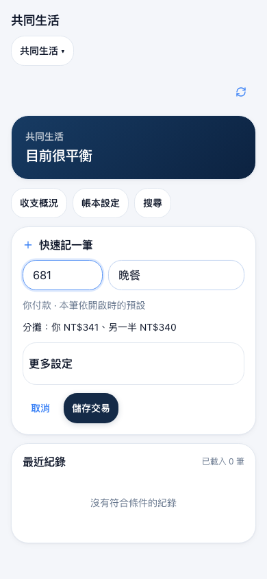
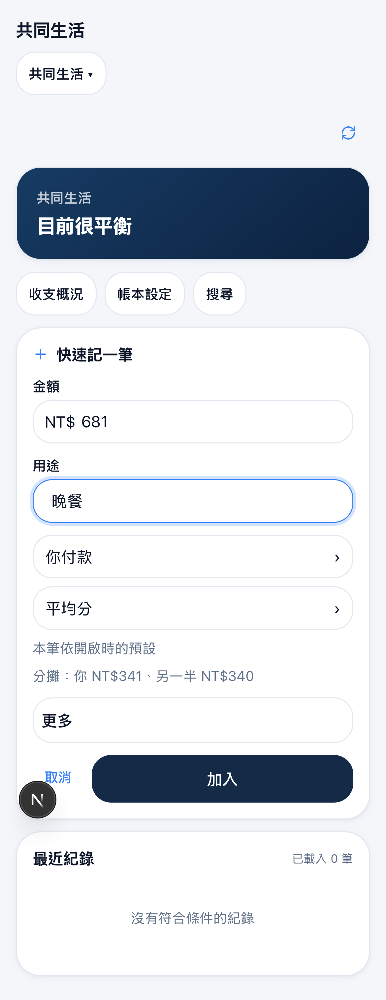
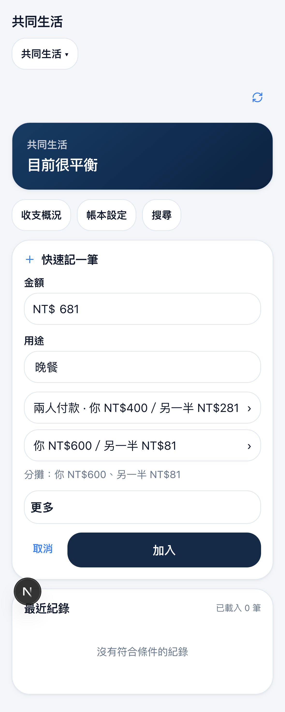
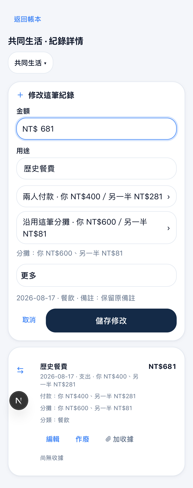
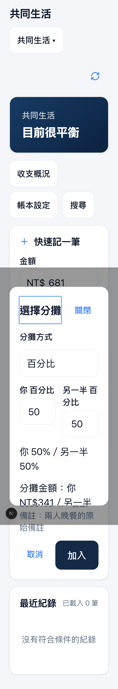

# P2-A browser and bundle evidence

Local final suite: **584 passed**, including **72 P2-A cases** (18 per required mobile project). Unit suite: **278 passed**, zero skips. Typecheck and production build pass. Raw lint exits nonzero with the same **280 errors / 37 warnings** as baseline; the existing baseline-delta gate passes with zero new findings. The final Issue report links hosted CI and PostgreSQL results separately.

| Engine | CSS viewport | Screenshots + JSON states | Recorded videos | Horizontal overflow | Minimum relevant target |
| --- | --- | --- | --- | --- | --- |
| Chromium | 390×844 | 34 | 18 | 0px | 44×44px |
| WebKit | 390×844 | 34 | 18 | 0px | 44×44px |
| Chromium | 393×852 | 34 | 18 | 0px | 44×44px |
| WebKit | 393×852 | 34 | 18 | 0px | 44×44px |

The IME/keyboard case temporarily reduces viewport height to 420px, then restores the required height. The primary action is entirely inside that reduced viewport after purpose Enter focuses it. 200% screenshots use a 200% root font size. Every captured state asserts exactly one dialog host. Target measurements cover visible editor controls and open payer/split controls.

[Browser summary](browser-summary.json) preserves all 136 states' geometry and command evidence. Each `*-command` state includes the actual intercepted request and independently normalized expected body. The replay state records both identical request byte strings. All IDs, users and commands in this evidence are synthetic fixtures.

The CI artifact `p2-a-editor-evidence` contains the full PNG/JSON set and 72 WebM recordings. It has 14-day retention; permanent representative images below remain in Git. Local originals are in `output/playwright/p2-a/` and `output/playwright/results/p2-a-entry-*/`.

## Before / after

The before image comes from a production build of exact baseline `18b64b168ee1afcfc2799f112536c0efbfdea7fe`, compiled before edits and served with the same mocked API/session data. It sends no write. The after image is WebKit mobile from the final suite. Both represent a 390×844 CSS viewport; image pixel density differs between the capture contexts.

| Baseline | P2-A |
| --- | --- |
|  |  |

## Representative states

| Both payers, 393×852 Chromium | Stored correction, 390×844 WebKit |
| --- | --- |
|  |  |

The full capture set also includes partner payer, 2:1 and 0:1 defaults, fractional percentages, exact allocations, income, transfer direction, More expanded, invalid split, modal keyboard focus, all three correction types and frozen replay. Command assertions are in [the E2E spec](../../../tests/p2-a-entry.spec.ts).

## Initial route gzip

Production `/page` initial JS uses deduplicated `rootMainFiles` plus `entryJSFiles` from the Next client-reference manifest, gzip level 9 per chunk. Baseline and candidate use the same Node/pnpm and CI stub build environment. [Raw measurements](performance.json) include chunk hashes and byte counts; [measurement script](../../../scripts/measure-entry-route.mjs) reproduces the method.

- Baseline: **191,224 bytes**.
- P2-A: **194,304 bytes**.
- Delta: **+3,080 bytes = 3.01 KiB**, below the 10KB incremental target.
- Runtime dependencies added: **0**; lockfile unchanged.
- Opening, selecting or applying payer/split sends **0 new requests**, asserted by request-count checks.

These are production-build bundle measurements and local browser automation evidence. Physical LINE WebViews, native keyboards, close/termination and actual authorization return remain unverified; G5 remains NOT COMPLETE / NOT PASS under Issue #8's current policy. See [the implementation report](../../p2-a-shared-entry-editor.md).
